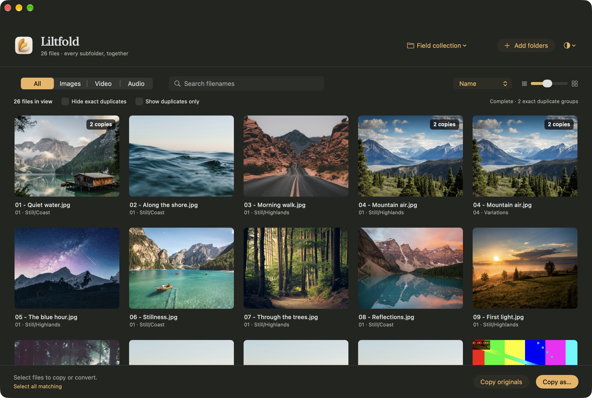

<p align="center"></p>

# Liltfold

A native macOS media browser for the files already on your Mac. Drop in a folder,
explore media across its subfolders, then copy or convert the files you choose.

[](https://github.com/hybes/liltfold/actions/workflows/ci.yml)
[](LICENSE)



Rust handles discovery, selection, duplicate checks and exports. SwiftUI and
AppKit provide the native interface; ImageIO and AVKit handle image previews and
playback. There is no web view, account, telemetry or cloud processing.

## What it does

- Browse multiple folder trees together, with recursive discovery, a virtualised
  grid, filename search, sorting and image/video/audio filters.
- Preview images, play video and audio, and resize the contact sheet. Original
  files stay where they are; opening a folder does not import them.
- Find exact duplicates by hashing and byte comparison. Choose a representative
  without deleting or changing any copy.
- Copy originals unchanged, or choose image, video and audio conversion settings
  independently. Exclude a media type or keep its originals in a mixed export.
- Review the scope, destination, naming and conflicts before starting. Unique
  filenames are the default. Cancellation discards the unfinished destination
  file and keeps completed files.

## Build and run

**Early release: build from source.** There is no public prebuilt app release yet.
The GUI targets Apple Silicon and macOS 14+. The Rust toolchain or bundled codecs
can require a newer macOS version; the build reads their targets and sets the app's
minimum accordingly. The original local build was tested on macOS 27.0.1.

Install Xcode/Command Line Tools, Python 3, Rust 1.88+ and the native codec tools.
For a Mac using Homebrew and an existing Rust installation:

```sh
brew install ffmpeg webp
git clone https://github.com/hybes/liltfold.git
cd liltfold
python3 tools/build.py
open dist/Liltfold.app
```

The build bundles `ffmpeg`, `ffprobe`, `cwebp` and their non-system libraries.
The resulting app runs without Homebrew or developer tools. It is ad-hoc signed
for local use, not notarised or submitted to the App Store. See
[third-party notices](THIRD_PARTY.md) before distributing a compiled bundle.

`python3 tools/build.py --ui-only` reuses bundled codecs during UI development.
Use a full build after changing the artwork. Build outputs are excluded from Git.

## Using Liltfold

Drop folders into the window or press **⌘O**. All subfolders are included.
Command-click toggles selection, Shift-click selects a range, arrow keys navigate,
**Space** opens a preview and **⌘A** selects every matching file, including those
offscreen. **Escape** closes previews. **⌘R** refreshes the collection.

The footer shows selected files hidden by filters. Right-click an exact duplicate
to inspect its locations or choose another representative. Duplicate checking
runs below visible-preview work and shows when it is incomplete.

**Copy originals** preserves file contents byte for byte. **Copy as…** offers
Keep original, conversion formats and Exclude for each media type:

| Media | Conversion outputs |
| --- | --- |
| Images | WebP, JPEG, PNG |
| Video | MP4/H.264, WebM/VP9 |
| Audio | MP3, M4A/AAC, WAV, FLAC |

Exports can preserve source paths or flatten folders, retain filenames or use a
prefix and sequence, and skip, rename or replace existing destination files.
Original source files are protected. Deduplicated exports finish content checks
before writing.

## Tests

The core tests run on macOS and Linux. They require no sample media or codecs.

```sh
cargo fmt --all -- --check
cargo clippy --locked --all-targets -- -D warnings
cargo test --locked
python3 -m unittest discover -s tests -p 'test_*.py'
```

On macOS, the integration test uses the actual ImageIO bridge and bundled codecs.
Generate the fixtures locally; no photographs or downloads are required:

```sh
python3 tools/make_fixtures.py
xcrun swiftc -O -swift-version 5 -parse-as-library \
  -import-objc-header native/Liltfold.h \
  tests/NativeSmoke.swift native/MediaBridge.swift target/release/libliltfold.a \
  -framework AppKit -framework ImageIO -framework UniformTypeIdentifiers \
  -o .build/native-smoke
.build/native-smoke dist/Liltfold.app '.build/fixtures/Field collection' .build/native-smoke-output
```

This checks 40 conversions, fully decodes their outputs, verifies dimensions,
duration and audio, rejects corrupt input and checks unchanged original hashes.
The generator refuses to overwrite a non-empty output folder; use `--output`
to choose another location. Add `--large` for a synthetic 5,000-file collection.

For native UI checks on a Mac with an active desktop and Screen Recording access:

```sh
python3 tools/build.py --ui-test
LILTFOLD_CACHE="$PWD/.build/ui-test-cache" \
LILTFOLD_UI_TEST_OUTPUT="$PWD/screenshots" \
dist/Liltfold.app/Contents/MacOS/Liltfold "$PWD/.build/fixtures/Field collection"
```

Optionally set `LILTFOLD_UI_TEST_LARGE` to the generated `Large collection` path.
Rebuild without `--ui-test` for normal use. CI runs Rust checks on Linux and
builds and tests the native codecs on an Apple Silicon macOS runner. UI automation
stays a local desktop check. [Verification and measured performance](VERIFICATION.md)
records the original test conditions and remaining gaps.

## Limits and data

- Image previews and conversions use the first frame of animated/multipage
  files. Preview images are capped at 4096 pixels; full-size exports are available.
  Conversion uses 8-bit output and can discard HDR, animation and metadata.
- Non-native playback containers such as WebM prepare a local compatibility
  preview first. Large files can take time. RAW support depends on the camera
  formats or embedded previews understood by ImageIO on the current Mac.
- Refresh discovers new files. Visible source changes invalidate previews
  automatically. Export destinations within a source tree are excluded from
  subsequent scans in that collection. Exporting into a source root or its
  ancestor is refused.
- Thumbnails, preview cache and preferences live in
  `~/Library/Caches/com.hybes.liltfold/`. The thumbnail memory-cache target is
  96 MiB/180 images; disk-cache pruning targets 768 MiB. Nothing is uploaded.

## Contributing and licence

See [CONTRIBUTING.md](CONTRIBUTING.md) for the code layout and development checks,
or [open an issue](https://github.com/hybes/liltfold/issues). Report vulnerabilities
privately using [SECURITY.md](SECURITY.md).

Liltfold's code and project artwork are provided under the [MIT licence](LICENSE).
The raster logo was generated with ImageGen; its [source prompt](assets/LOGO.md)
is included. Codec dependencies and the photographs shown in documentation retain
their own licences; see [THIRD_PARTY.md](THIRD_PARTY.md).
